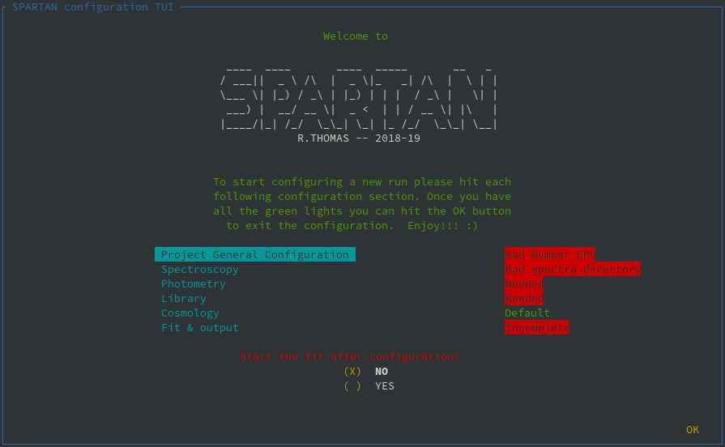
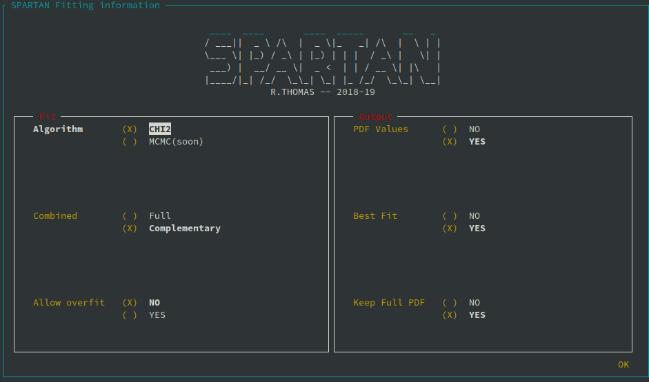

.. _TUI:

|python| |Python36| |Licence|
|matplotlib| |PyQt5| |numpy| |scipy| 

.. |Licence| image:: https://img.shields.io/badge/License-GPLv3-blue.svg
      :target: http://perso.crans.org/besson/LICENSE.html

.. |Opensource| image:: https://badges.frapsoft.com/os/v1/open-source.svg?v=103
      :target: https://github.com/ellerbrock/open-source-badges/

.. |python| image:: https://img.shields.io/badge/Made%20with-Python-1f425f.svg
    :target: https://www.python.org/downloads/release/python-360/

.. |PyQt5| image:: https://img.shields.io/badge/poweredby-PyQt5-orange.svg
   :target: https://pypi.python.org/pypi/PyQt5

.. |matplotlib| image:: https://img.shields.io/badge/poweredby-matplotlib-orange.svg
   :target: https://matplotlib.org/

.. |Python36| image:: https://img.shields.io/badge/python-3.6-blue.svg
.. _Python36: https://www.python.org/downloads/release/python-360/

.. |numpy| image:: https://img.shields.io/badge/poweredby-numpy-orange.svg
   :target: http://www.numpy.org/

.. |scipy| image:: https://img.shields.io/badge/poweredby-scipy-orange.svg
   :target: https://www.scipy.org/

Text Based User interface: configuration of a fitting run
=========================================================

Start the TUI
^^^^^^^^^^^^^

As said in :doc:`usage`, you start SPARTAN using the command line. Here we document the text based user interface that is used to configure a fitting run. For a brand new project, you start in the terminal:

.. code-block:: shell

           [user@machine]$ spartan -t (or --tui)

This will load the text based user interface (TUI) with an empty project. If you happen to have an already defined project, you must precise the file that the TUI will use:

.. code-block:: shell

           [user@machine]$ spartan -t /path/and/file.conf (or --tui)

To make sure that the TUI is well displayed the size of your terminal must be at least 30x80. If this is the case, running one of the command above will lead you to the front frame of the TUI that you can see below.

.. note::

   To navigate through the TUI you need the arrow keys of your keyboard to move from on element to another and the carriage return to enter a new element. The space bar is used to select a choice in a multiple choice element (see below).

This frame contains the SPARTAN logo and the welcome message. These are fixed components. Then you haves an area with 6 entries: Project general Configuration, Spectroscopy, Photometry, Library, Cosmology, Fit & output. Each section corresponds to a TUI-frame that will help you through the configuration of your fitting run. On the same line as the section,  a keyword is displayed. If it is green (like for the Cosmology section in the screenshot above), it means that the section is correctly configured.  In green you can have  'Default' or 'Done'. Once each section status is in green you can start a fitting run. If you made a mistake during the configuration (or something is missing), the status will be displayed in red. The red status keywords should be clear enough by themselves. Each one will be reviewed in the next sections so you have a more detailed description of the error and a work around.

Below this sections you have a choice to start the fitting run from the TUI or not. Select your choise with the space bar. If you choose not to start it from the TUI you can still do it from the Command Line Interface.

Finally, to Leave the TUI you must go to the 'OK' at the bottom right and press enter.

General Configuration
^^^^^^^^^^^^^^^^^^^^^

.. figure:: ./TUI/TUI_genconf.png
    :width: 750px
    :align: center

To start configuring a fitting run, you enter the **Project General Configuration** page of the TUI (you can see it above). This frame deal with general information:

   * **Project Name**: This is how you call your fitting run/project. This name must note contain spaces.
   * **Author**: Well, you.... It is worth noting that this value is not used anywhere in the code. So you can write whatever you want here (e.g. date). It will be written in the configuration file.

   * **Project Directory**: This is where the data will be saved (the current directory). To modify the value you must press enter and navigate.

   * **CPU**: SPARTAN has been coded to do parallel processing. Here you tell SPARTAN how much CPU's you want to use at the same time (i.e., how much object can be fitted in parallel).

   * **Spectroscopy**: Yes or no if you use spectroscopy

   * **NSpec**: in case the previous field was 'yes', tell how many spectra per object you have.

   * **Photometry**: Yes or not to use the photometry (no if you want to fit spectra only).

Spectroscopic configuration
^^^^^^^^^^^^^^^^^^^^^^^^^^^

.. figure:: ./TUI/tui_spec.png
    :width: 750px
    :align: center

If you have spectroscopic data, you must then tell SPARTAN where they are and what is your configuration.

 * **Spectra Directory**: This is where your spectra are stored (in ascii format!! and with a .spec extension).

 * **Resolution**: This is the average reoslution (R=l/dl) of your spectra. 
 * **Units (flux)** and **Units (wavelength)**: Here you can choose the units of your spectra. Both for the flux density and the wavelength.

 * **Skip Edges**: It can happen that the edges of your spectra are not well cleaned. SPARTAN offers you the opportunity to remove them from the fit. If you say yes, here you must also give the size to skip at the edged with **Size to skip (AA, obs-f)**. You must give it in angstrom and in the observed frame.

 * **Bad regions**: Also, you might want to mask out some part of the spectrum (e.g. emission lines). You can also do it SPARTAN putting yes at this choice. Then you must give the regions you want to mask out in **If Yes, list (rest-f, AA)**. In that case you must give the two external wavelength of each region you want to mask out (ex: 3700-3750; 1200-1240)

 * **Nor Dat/Mod**: This is where you tell SPARTAN how to normalize the templates to the data. You can do it with the photometric point you give in the catalog or with a restframe region that will be taken into account for the normalization. In the latter case you must give this the wavelengths of this restframe region (l1-l2) in Angstrom.

 * **Fit multi-spec calib**: This applies only if you fit multi-spectroscopic data. In this case you can ask SPARTAN to try to fit the relative flux calibration between both spectra (this is rather experimental for the moment).

Photometric configuration
^^^^^^^^^^^^^^^^^^^^^^^^^

.. figure:: ./TUI/tui_phot.png
    :width: 750px
    :align: center

This section is for photometric configuration. **You also need to use it for spectroscopy!!!**. You must choose your photometric system (AB of Jansky[Jy]). Then SPARTAN will read the data catalog you gave in the general configuration section and will extract the name of each filter that is in your catalog. For each filter, a line will be created with the name of the filter from the catalog, and 5 fields to complete. First you must select the corresponding filter from the filter library of SPARTAN (if your filter is not yet there, please drop me a mail). Then you must choose if this filter will be used during the fit, if your want the magnitude in this filter to be computed from the best fit template, if you want to compute the absolute magnitude, if you want to use this filter for normalisation (you can selec more than one).

Template configuration
^^^^^^^^^^^^^^^^^^^^^^

Cosmological configuration
^^^^^^^^^^^^^^^^^^^^^^^^^^

.. figure:: ./TUI/Tui_cosmo.png
    :width: 750px
    :align: center

When doing the fit, you can ask SPARTAN to take into account a cosmological model. This means that at a given redshift, the possible age of the templates will be smaller than the age of the Universe at that redshift. By default, the use is set on Yes with the Lambda-CDM model.

Fitting and output configuration
^^^^^^^^^^^^^^^^^^^^^^^^^^^^^^^^

Finally, you can choose what kinf of fit and output you want. In the panel (see above) you can choose the type of fitting. **As for now the MCMC is not implemented yet** so you can only choose the CHI2 minimization. When fitting both photometry and spectroscopy you can choose to either fit all the data (Combined = Full)

