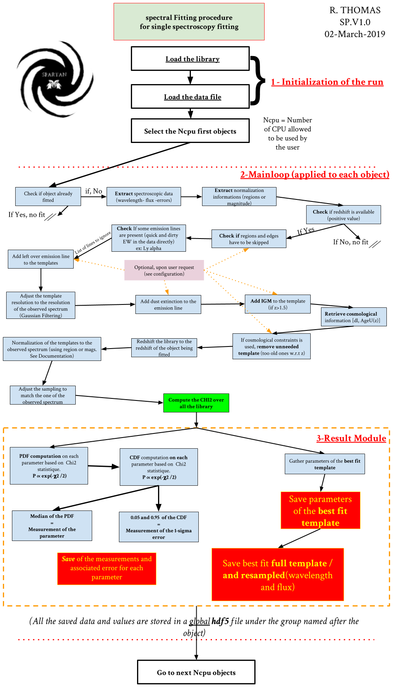

.. _Spectroscopic:

|python| |Python36| |Licence|
|matplotlib| |PyQt5| |numpy| |scipy| 

.. |Licence| image:: https://img.shields.io/badge/License-GPLv3-blue.svg
      :target: http://perso.crans.org/besson/LICENSE.html

.. |Opensource| image:: https://badges.frapsoft.com/os/v1/open-source.svg?v=103
      :target: https://github.com/ellerbrock/open-source-badges/

.. |python| image:: https://img.shields.io/badge/Made%20with-Python-1f425f.svg
    :target: https://www.python.org/downloads/release/python-360/

.. |PyQt5| image:: https://img.shields.io/badge/poweredby-PyQt5-orange.svg
   :target: https://pypi.python.org/pypi/PyQt5

.. |matplotlib| image:: https://img.shields.io/badge/poweredby-matplotlib-orange.svg
   :target: https://matplotlib.org/

.. |Python36| image:: https://img.shields.io/badge/python-3.6-blue.svg
.. _Python36: https://www.python.org/downloads/release/python-360/

.. |numpy| image:: https://img.shields.io/badge/poweredby-numpy-orange.svg
   :target: http://www.numpy.org/

.. |scipy| image:: https://img.shields.io/badge/poweredby-scipy-orange.svg
   :target: https://www.scipy.org/

Spectroscopic fitting
=====================

Configuration
^^^^^^^^^^^^^

Spectra files
-------------

To run the fit of single or multi-λ spectroscopy you need to provide SPARTAN with a catalog of data containing all the necessary informations. The spectra that you provide to SPARTAN must be either in ascii or in fits file. If you choose the ascii format the spectra have to be in the following 3-column format: 

.. centered::
	Wavelength - Flux density - error

The name of each spectrum must end with the '.spec' extension, example: **spectrum_1.spec**
At the moment the only units allowed in SPARTAN are angstrom for the wavelength and erg/s/cm2/AA for the flux density.

.. danger::
        It is important to note that when fitting multiple spectra for a given object, these spectra MUST NOT overlap.

You can find an example of such file here :download:`Spectroscopic input <examples/Example_Spectro.txt>`

Associated photometry
---------------------

For each spectrum you need to associate a photometric band which will serve as flux calibration of the spectroscopy. Of course this band must be in the wavelength domain of the spectrum (the filter must be entirely in the wavelength domain). For example, using VIMOS data (3600Å to 9500Å) you can provide the r-band. During the preparation of the data SPARTAN will normalize each spectrum to that band. If you do not have any available band you can create a fake one and keep in mind that paramters based on the normalization will not be correct (e.g. Stellar Mass). Nevertheless, when fitting multiple spectrum at once (for the same galaxy), it can not be a fake band because the fit is gonna use the relative calibration between the multiple spectra.
It can happen that for few object in the sample, the photometric band is not available. In that case the band should have a negative value (e.g. -99.9). In that case, SPARTAN will compute a photometric point from the spectrum itself using a square filter.

Final spectroscopic catalog for fitting run
-------------------------------------------

The catalog that you need to give to SPARTAN is an ascii file. When SPARTAN opens it, it will read the header. Whatever you want to fit the header of the catalog must start with two columns: ID and redshift with an hash(#) at the beginning of the line. THIS IS MANDATORY:

.. centered::
	#ident     redshift

Then you must add the columns with the following rules:

* **For single spectroscopy**: When you just have one spectrum in ascii format you must add three columns after '#ident     redshift'. One for the spectrum name and two for the associated magnitude (measurement and error). Therefore you will have:

.. centered::
  	#ident     redshift  spec   mag    mag_err

* **For multi-spectroscopy**: When you want to fit multi-spectroscopy, you have to follow the same method and add as many 3 columns set as you have spectra. Therefore you will have (for three spectra):

.. centered:: 
 	#ident     redshift  spec1   spec1_mag    spec1_mag_err   spec2   spec2_mag    spec2_mag_err  spec3   spec3_mag    spec3_mag_err

During the preparation of the data, each spectrum will be normalized to it own magnitude. Everything is saved under the data file: *Project_name_dat.hdf5*

Fitting procedure: generalities
^^^^^^^^^^^^^^^^^^^^^^^^^^^^^^^

The flow chart shows the detailed procedure of the fit of a sample of  single spectra. It is composed of 3 parts:

* The initialization of the run where we load the library and the sample to fit.
* The main loop. Where are actually making the fit
* The results module where we save the results of a fit and where the final catalog of parameter is created

We describe in detail each parts below in the following paragraphs.

The Initialization
------------------

Here SPARTAN load the library that was computed from the configuration of the user. It loads both the table of parameters (and their names) and the table of templates. Everything is loaded from the .hdf5 library file.
Then the code takes the _dat.hdf5 file that was created from the configuration and the catalog of data that was given. He will make a quick loop over the full sample to check if some objects were already fitted. If so they will be skipped (unless the user allow the overfit, c.f. configuration above and TUI.)

 

.. warning::
	 This first check is important. It means you can stop a fitting run at any moment and start it again from where you stopped, without needing to start all the run over from the beginning.  

From the left over objects to plot, SPARTAN will take the firsts Ncpu (see :doc:`TUI`) object in the list and will send them to the fitting function. Each object will be fitted in parallel.

The main function
-----------------

We describe here the main loop for a given object.
The main function starts by checking again if  the object have to be fitted. If yes, SPARTAN extracts, from the _dat.hdf5 file, the spectroscopic informations of the object (wavelength, flux and error). Then it extracts the normalization informations (it can be magnitude or regions, see section 2 above). The redshift is also retrieved. If this redshift is negative SPARTAN will not perform the fitting. If the user asked for some regions to be skipped SPARTAN will do it at this moment (see section 2 above).

Then SPARTAN will adjust the library. It will start by checking if one of the line in the line file is present by performing a quick-and-dirty estimation of the EW on the spectrum itself (particularly usefull for lines that can be in absorption or in emission). If some of those lines are absent then it will create a list of absent line. After this pre-check SPARTAN will add the emission lines to the library, skipping the lines that are absents. Then SPARTAN will adjust the resolution of the templates (see resolution). Once this is done,  SPARTAN will apply the extinction: the Dust and IGM extinction (see :doc:`templates`) . At this point SPARTAN will check if some template have to be ignored. It is the case when templates ages are older than the age of the universe at the redshift we are fitting. The left over templates are then redshifted to the observed redshift and the templates wavelength grid is adjusted to the observed wavelength grid. This library is then used to compute the chi2. 

The result module
-----------------

From the library of chi2, SPARTAN computes the PDF and the CDF for each parameter. This will give access to the parameter measurements and their errors. If the user ask for it, the parameters from the best fit template (therefore without error) can be saved as well (see below). Aditionnaly, SPARTAN saves the best fit template (both original and resampled templates).

Data/Template Normalization in the case of Spectroscopy
^^^^^^^^^^^^^^^^^^^^^^^^^^^^^^^^^^^^^^^^^^^^^^^^^^^^^^^

As explained above, a step of the fitting procedure is the normalisation of the models to the observations. When dealing with photometry only, this normalisation is done with one or few passbands (see :doc:`photometry`). For the spectroscopy it can be done as well using the same method. That's also why the spectroscopic data catalog must include a magnitude measurement so all the template (and the data) will be normalize to that band (see above). In this case, the normalization of the spectroscopy will be done in the same band at all redshift. If the data catalog contains the *i*-band, then all the spectra will be normalize to that band. This leads to a difference of treatment between galaxies. For example, if in my catalog, I fit 3 galaxies, one at z=1, one at z=2 and the third at z=4, the *i*-band will correspond to different rest-frame regions. For the first galaxy, it will corresponds to a restframe region around 4200Å, for the second galaxy it will correpond to a region around 2800Å and for the last one the restframe region will be around 1700Å. Therefore all the galaxies are not treated in the same way. For photometry we do not have other option but for spectroscopy there is another way that we called the *redshift-dependent* normalisation. In this case, we consider a restframe region that is **ideally free of emission line and wide enough to be independent of the noise**. During the fit, SPARTAN is redshifting this regions and creating a box filter in the redshifted region. The spectrum is then convolved through this box filter and a magnitude is computed. Finally all the template are normalised to that magnitude. Going to the next object, at a different redshift, the redshifted region will be at another place of the spectrum observed window and the box filter will be at different wavelength. 

With this method, all the galaxies are normalized in the same restframe region. Moreover, as the user is free to select whatever restframe region it is more reliable to choose emission line free area and which make the fit more stable as it does not rely on the emission line models.

 
Results: Final catalog production and GUI vizualization
^^^^^^^^^^^^^^^^^^^^^^^^^^^^^^^^^^^^^^^^^^^^^^^^^^^^^^^

At the end of the fitting run, SPARTAN creates automatically the final catalog. Depending on what you asked for, it will contain:

* The ID, redshift and number of points used during the fitting run
* The PDF parameters (measurement and errors, ex: PDF_SFR, m1s_SFR, p1s_SFR)
* The Parameters from the best fit template (no errors in this case, ex: BF_SFR).  The best fit template is also saved so you can have a direct comparison between observations and models.

After the fit you can also load the result file into the SPARTAN GUI. This will allow you to visualize the individual fits (see below). It can also show you the global result of your sample. Go to the :doc:`GUI` GUI documentation for more information.

