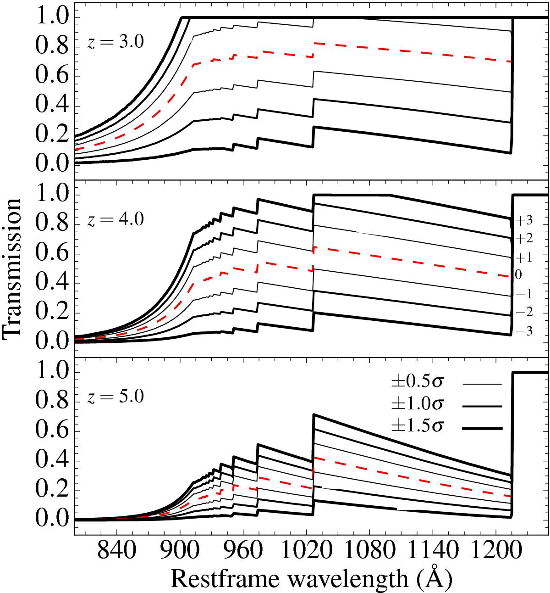

.. _Templates:

|python| |Python36| |Licence|
|matplotlib| |PyQt5| |numpy| |scipy| 

.. |Licence| image:: https://img.shields.io/badge/License-GPLv3-blue.svg
      :target: http://perso.crans.org/besson/LICENSE.html

.. |Opensource| image:: https://badges.frapsoft.com/os/v1/open-source.svg?v=103
      :target: https://github.com/ellerbrock/open-source-badges/

.. |python| image:: https://img.shields.io/badge/Made%20with-Python-1f425f.svg
    :target: https://www.python.org/downloads/release/python-360/

.. |PyQt5| image:: https://img.shields.io/badge/poweredby-PyQt5-orange.svg
   :target: https://pypi.python.org/pypi/PyQt5

.. |matplotlib| image:: https://img.shields.io/badge/poweredby-matplotlib-orange.svg
   :target: https://matplotlib.org/

.. |Python36| image:: https://img.shields.io/badge/python-3.6-blue.svg
.. _Python36: https://www.python.org/downloads/release/python-360/

.. |numpy| image:: https://img.shields.io/badge/poweredby-numpy-orange.svg
   :target: http://www.numpy.org/

.. |scipy| image:: https://img.shields.io/badge/poweredby-scipy-orange.svg
   :target: https://www.scipy.org/

Templates
=========

SSPs: Basis of template building
^^^^^^^^^^^^^^^^^^^^^^^^^^^^^^^^

Extinction by dust
^^^^^^^^^^^^^^^^^^

Extinction by the Intergalactic Medium (IGM)
^^^^^^^^^^^^^^^^^^^^^^^^^^^^^^^^^^^^^^^^^^^^
At the moment SPARTAN includes two (actually three) different IGM prescription:

 * The prescription of `Madau+95 <https://ui.adsabs.harvard.edu/#abs/1995ApJ...441...18M/abstract>`_
 * The prescription of `Meiksin+06 <https://ui.adsabs.harvard.edu/#abs/2006MNRAS.365..807M/abstract>`_
 * Both of the previous prescription can be enhanced by the models of `Thomas+17 <https://ui.adsabs.harvard.edu/#abs/2017A&A...597A..88T/abstract>`_

The two first prescription provide a single IGM extinction curve per redshift which corresponds to the mean transmission at the considered redshift (these are accessible via **mean_meiksin** and **mean_madau**) during the configuration of a fitting run. Nevertheless, this assumes that at a certain redshift, all the LOS are populated by equivalent gazeous clouds density with equivalent properties. In Thomas+17 we created additional empirical curves that allows one to give a little bit more freedom. At any redshift, this prescription provides 6 additional curves that represent +/- 0.5, 1.0 and 1.5 sigma from the average curve. Example of curves sets are given in the figure (from Thomas+17) below.

This prescription are available for both Madau and Meiksin configuration and are accessible via **free_madau** and **free_meiksin** during the configuration.

In the output of SPARTAN, 3(+3) parameters are computed:

 * The **Lyman alpha transmission**, computed between 1070 and 1170 Ang
 * The **Lyman beta transmission**, computed between
 * The **Lyman gamma transmission**, computed between

These quantities are computed on the IGM template itself and as an average of the transmission in the given wavelength ranges.
For each of these parameters, the Best fit and PDF estimation are given (so 3+3 parameters).
