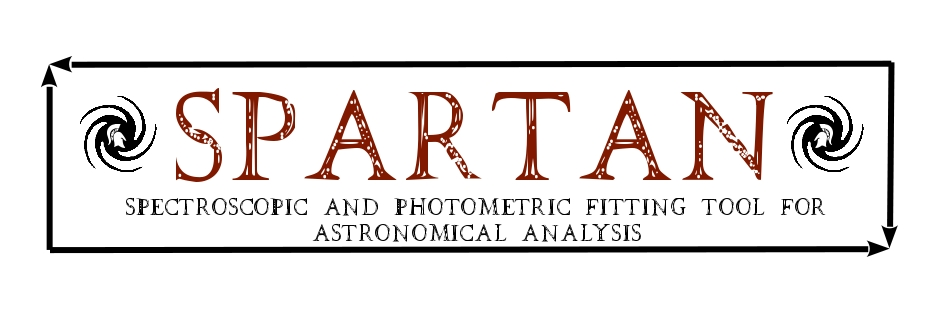

.. SPARTAN documentation master file, created by
   sphinx-quickstart on Mon Aug 13 13:21:36 2018.
   You can adapt this file completely to your liking, but it should at least
   contain the root `toctree` directive.

|python| |Python36| |Licence|
|matplotlib| |PyQt5| |numpy| |scipy| 

.. |Licence| image:: https://img.shields.io/badge/License-GPLv3-blue.svg
      :target: http://perso.crans.org/besson/LICENSE.html

.. |Opensource| image:: https://badges.frapsoft.com/os/v1/open-source.svg?v=103
      :target: https://github.com/ellerbrock/open-source-badges/

.. |python| image:: https://img.shields.io/badge/Made%20with-Python-1f425f.svg
    :target: https://www.python.org/downloads/release/python-360/

.. |PyQt5| image:: https://img.shields.io/badge/poweredby-PyQt5-orange.svg
   :target: https://pypi.python.org/pypi/PyQt5

.. |matplotlib| image:: https://img.shields.io/badge/poweredby-matplotlib-orange.svg
   :target: https://matplotlib.org/

.. |Python36| image:: https://img.shields.io/badge/python-3.6-blue.svg
.. _Python36: https://www.python.org/downloads/release/python-360/

.. |numpy| image:: https://img.shields.io/badge/poweredby-numpy-orange.svg
   :target: http://www.numpy.org/

.. |scipy| image:: https://img.shields.io/badge/poweredby-scipy-orange.svg
   :target: https://www.scipy.org/

Welcome to SPARTAN's documentation!
===================================

The SPARTAN program is a project of astronomical tool to fit the spectroscopy and photometry of distant galaxies. It was designed by a survey proposed to ~40 astronomers. As so, it is as close as possible to the needs of the community. This tool is written entirely in python with an heavy use of scientific libraries like numpy,  scipy and multi-processing.

Contents
^^^^^^^^
.. toctree::
   :maxdepth: 1

   Home <self>
   installation
   usage
   spectroscopy
   GUI
   Conferences

News
^^^^
* **01-10-2017** : New website ! Combined fit (multi-spectro + multi-photo) is done. Simulations are on-going. Paper of presentation of SPARTAN is being written in parallel. Slide and Poster for the ADASS conference can be found here.
* **08-08-2017** : Short Talk accepted (with poster and proceedings) at the ADASS conference in Santiago (late october 2017)
* **19-06-2017** : The fit on the spectroscopy is done, working on the joined analysis of photometry ans spectroscopy. A graphical user interface (GUI) have been created to allow the user to look at the results (HERE) A decision to create a SPARTAN-SIM (Simulation) module have been taken. It allows to simulate Galaxy data (Photometry and/or spectroscopy). SPARTAN will be presented at the EWASS conference (Prague) at the end of the month and an abstract to the ADASS conference will be submitted (Santiago, late 2017). SUMMER time will be dedicated to Simulations to study the parameter estimation of different kind of fits:  photometry vs single spectroscopy vs multi-spectroscopy vs multi-spectroscopy + photometry
* **01-04-2017**:  Version 0.2 of the TUI is released (Here). Tests of the fit on the photometry released (Here). The development of the fit on the spectroscopy. It will take into account fit on individual and multiple spectra for a given object.
* **13-12-2016**: Version 0.1 of the TUI is released (Here)
* **14-11-2016**: First fit done (Photometry + Chi2).
* **27-09-2016**: TUI and CLI are done. The code of the Fitting engine of SPARTAN is about to be started.
* **20-06-2016**: Kickoff survey closed. ~40 Answers gathered (Here). The final design of SPARTAN 1.0 can be seen in the Final Design Page

.. warning::
 
	**Copyright**
 
	ATACAMA is a free software: you can redistribute it and/or modify it under 
	the terms of the GNU General Public License as published by the Free Software Foundation, 
	version 3 of the License.
 
	Photon is distributed without any warranty; without even the implied warranty of merchantability 
	or fitness for a particular purpose.  See the GNU General Public License for more details.
 
	You should have received a copy of the GNU General Public License along with the program.
	If not, see http://www.gnu.org/licenses/ . 
  
Contact : rthomas@eso.org & thespartanproj@gmail.con
